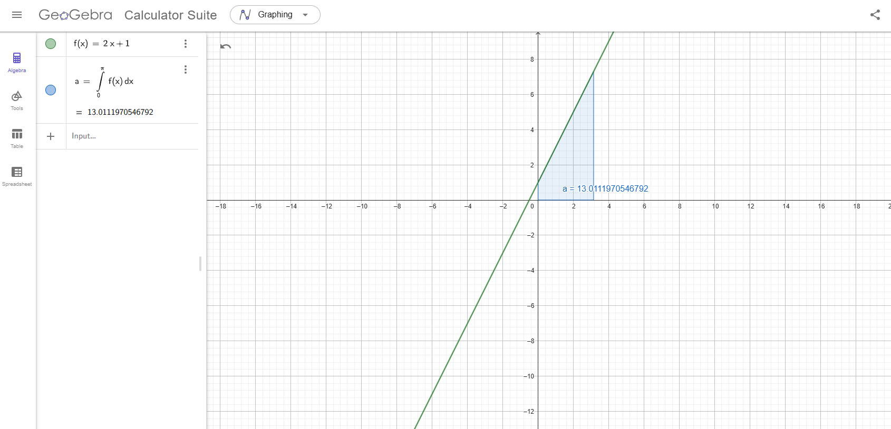

### 1. Compute the integral of $f(x) = 2x + 1$ over the interval $[0, \pi]$

We want to compute:

$$
I_1 = \int_0^\pi (2x + 1) \, dx
$$

#### Step-by-step solution:

1. **Integral of $2x$:**
   The integral of $2x$ is $x^2$, because $\int 2x \, dx = x^2$.
   
2. **Integral of $1$:**
   The integral of $1$ is $x$, because $\int 1 \, dx = x$.

Now, combining these:

$$
I_1 = \left[ x^2 + x \right]_0^\pi = \left( \pi^2 + \pi \right) - (0^2 + 0) = \pi^2 + \pi
$$

Thus, the integral of $f(x) = 2x + 1$ over $[0, \pi]$ is:

$$
I_1 = \pi^2 + \pi
$$

---

### 2. Compute the integral of $g(x) = x^2$ over the interval $[0, \pi]$

Now, we compute:

$$
I_2 = \int_0^\pi x^2 \, dx
$$

#### Step-by-step solution:

1. **Integral of $x^2$:**
   The integral of $x^2$ is $\frac{x^3}{3}$, because $\int x^2 \, dx = \frac{x^3}{3}$.

Now, evaluating this from 0 to $\pi$:

$$
I_2 = \left[ \frac{x^3}{3} \right]_0^\pi = \frac{\pi^3}{3} - 0 = \frac{\pi^3}{3}
$$

Thus, the integral of $g(x) = x^2$ over $[0, \pi]$ is:

$$
I_2 = \frac{\pi^3}{3}
$$

---

